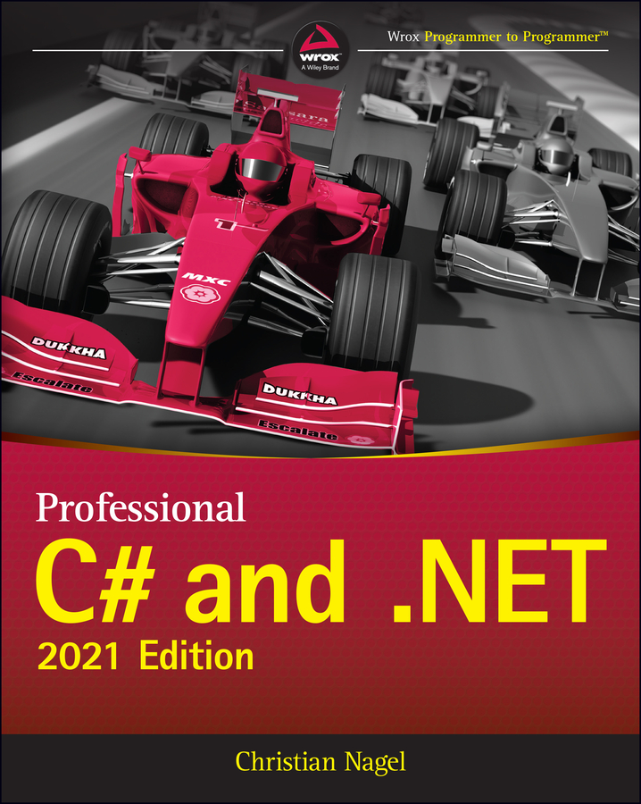

# ProfessionalCSharpAndDotnet12CHS  

## 概述  

  

本仓库提供《C# 高级编程（第十二版）》中英文译文的EPUB文件源代码。您可以通过以下命令克隆仓库：  

```bash
git clone https://github.com/ClassicByteInc/ProfessionalCSharpAndDotnet12CHS.git
```  

阅读方式：直接打开源文件 `navigation.xhtml` 即可，路径为：  

```bash
ebook_src/OPS/navigation.xhtml
```  


## 翻译方法  

1. **工具与流程**：使用浏览器插件 **沉浸式翻译** 的「翻译网页」功能，将翻译后的网页源代码直接整合至项目中。  
2. **翻译模型**：采用「沉浸式翻译」内置的 **智谱GLM翻译模型** 进行文本处理。  


## 勘误与贡献  

如果发现翻译错误、遗漏或需要优化的内容，欢迎通过以下方式参与改进：  
- 在仓库中提交 **Issue** 反馈问题；  
- 直接提交代码贡献，共同完善翻译内容！  


### 说明  
本项目基于开源协作模式运行，任何对C#及.NET技术感兴趣的开发者均可参与共建。如需技术支持或协作，请随时通过仓库渠道联系。